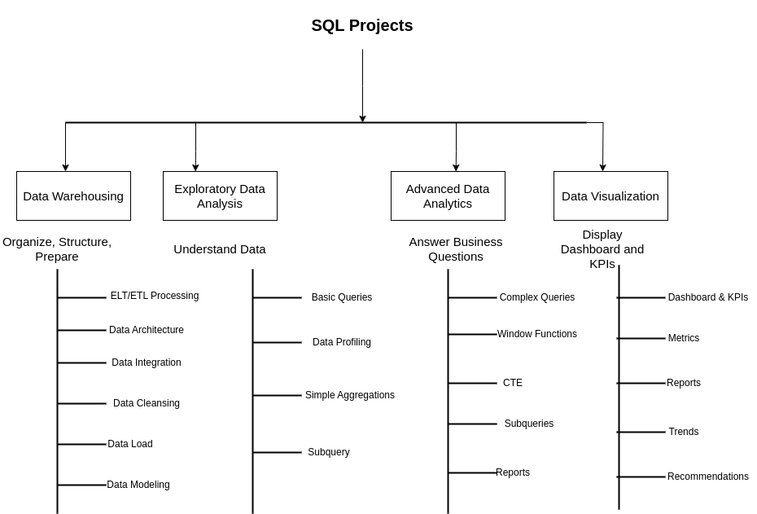

# Superstore-Analysis

This repository is part of a comprehensive data analytics pipeline for the popular Superstore dataset. The project is divided into three main repositories that together demonstrate a complete data analytics lifecycle—from raw data ingestion to business insights and visual storytelling.

---

**Repository Overview**

1. **Data Warehouse**
Cleaning, transforming, and structuring raw data into bronze, silver, and gold layers.

2. **Data Analysis**
Conducting Exploratory Data Analysis (EDA) and advanced SQL-based analytics.

3. **Data Visualization**
Creating an interactive dashboard in Tableau and business reports for decision-making.

---

**Data Warehousing**
#### Objective
Develop a modern data warehouse using SQL Server to consolidate sales data, enabling analytical reporting and informed decision-making.

1. **Bronze Layer**
- Purpose: Raw ingestion of source data without any modifications.
- Object Type: Tables
- Load Type: Batch processing, Full load using Truncate & Insert
- Transformations: No transformations
- Data Modeling: No data model

2. **Silver Layer**
- Purpose: Prepares data for analytical consumption by cleaning and enriching.
- Object Type: Tables
- Load Type: Batch processing, Full load using Truncate & Insert
- Transformations Include:
   - Data cleaning (e.g., null handling, deduplication)
   - Data standardization (e.g., consistent formats, casing)
   - Data normalization (e.g., splitting full names, unpivoting)
   - Derived columns (e.g., profit margin, order month)
   - Data enrichment (e.g., joining external lookup tables)
   - Data Modeling: No formal data model yet

3.**Gold Layer**
- Purpose: Delivers final datasets for BI, analytics, and reporting.
- Object Type: Views
- Load Type: No physical data load (computed views on demand)
- Transformations Include:
✅ Data integration (combining multiple silver tables)
✅ Aggregations (e.g., monthly sales by region)
✅ Business logic implementation (e.g., profit classification)
- Data Modeling:
✅ Star schema (fact and dimension tables)
✅ Flat tables (denormalized for dashboards)
✅ Aggregated tables (for KPI performance)

---

### Data Analysis (Exploratory & Advanced Analytics)

1. **Exploratory Data Analysis (EDA)**
- Understand dataset structure
- Missing value analysis
- Outlier detection
- Descriptive statistics
- Category-wise trends (Sales, Profit, Quantity)

2. **Advanced SQL Analytics**
- Window functions for running totals, moving averages
- Cohort analysis for customer retention
- RFM analysis (Recency, Frequency, Monetary)
- Market Basket Analysis using association rules (optional)
- Profit margin trends by segment, category, sub-category
- Tools Used: Postgresql

---

### Data Visualization (Dashboarding)

**Tableau Dashboard**
- Interactive dashboard answering key business questions:
- Regional and Segment-based performance
- Top-selling and underperforming products
- Sales vs. Profit heatmaps
- Monthly/Quarterly Sales trends

---

## 🛠️ Important Links & Tools:

Everything is for Free!
- **[Datasets](datasets/):** Access to the project dataset (csv files).
- **[SQL Server Express](https://www.microsoft.com/en-us/sql-server/sql-server-downloads):** Lightweight server for hosting your SQL database.
- **[SQL Server Management Studio (SSMS)](https://learn.microsoft.com/en-us/sql/ssms/download-sql-server-management-studio-ssms?view=sql-server-ver16):** GUI for managing and interacting with databases.
- **[Git Repository](https://github.com/):** Set up a GitHub account and repository to manage, version, and collaborate on your code efficiently.
- **[DrawIO](https://www.drawio.com/):** Design data architecture, models, flows, and diagrams.
- **[Notion](https://www.notion.com/):** All-in-one tool for project management and organization.
- **[Notion Project Steps](https://thankful-pangolin-2ca.notion.site/SQL-Data-Warehouse-Project-16ed041640ef80489667cfe2f380b269?pvs=4):** Access to All Project Phases and Tasks.

---

