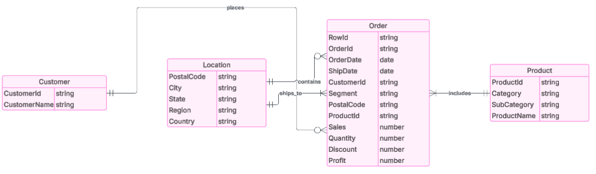
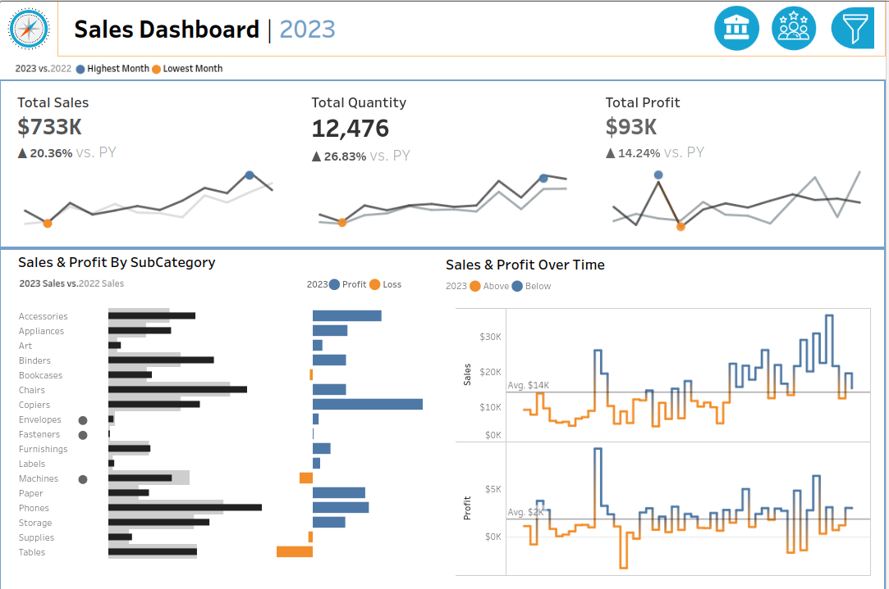
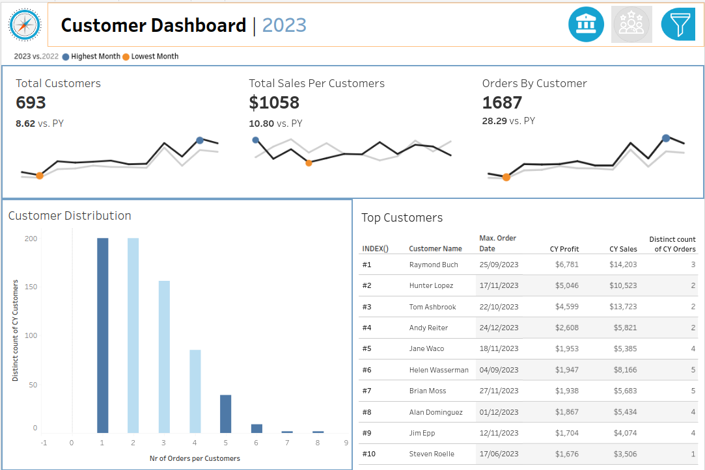

# Superstore Dashboard Analysis Report

---
## Project Background

This project aims to analyze the performance of a retail business using the Superstore dataset in Tableau. The goal was to build interactive dashboards to extract actionable insights into sales trends, product performance, and customer behavior for the year 2023, and benchmark them against 2022 performance.

The dashboards are split into:
1. **Customer Dashboard**: to understand customer engagement and value.
2. **Sales Dashboard**:  to evaluate product-level performance and revenue drivers.

---

## Key Areas of Analysis

**Sales and Customer Trends**: Present the data on a monthly basis for both current and previous year and identify months with highest and lowest sales.

**Product Subcategory Comparison**: Compare sales performance by different product subcategories for current and previous year and include a comparison of sales with profit.

**Weekly Trends for Sales & Profit**: Present weekly sales and profit data for current year along with average weekly values and highest weeks that are above and below the average.

**Customer Distribution by Number of Orders**: Represent the distribution of customers based on the number of orders they have placed to provide insights into customer behavior, loyalty and engagement.

**Top 10 customer by Profit**
Present the top 10 customers who have generated the highest profits for the company along with additional information like rank, number of orders, current sales and last order date.

An interactive tableau dashboard can be **[viewed](https://public.tableau.com/views/SalesDashboard_17473827691380/SalesDashboard?:language=en-GB&:sid=&:redirect=auth&:display_count=n&:origin=viz_share_link)** here.

The sql queries utilized to inspect and perform quality check can be **[found](Superstore-Analysis/data-warehouse/tests)** here.

The SQL queries utilized to clean, organize and prepare data for the dashboard can be **[found](Superstore-Analysis/data-warehouse)** here.

Targeted SQL queries regarding various business questions can be **[found](Superstore-Analysis/sql-analysis)** here.

---

## Data Structure and Initial Checks

Superstore database structure as seen below consists of four tables: orders, customers, location and products with a total row count of 13,313 records.

---

## Executive Summary

## Overview of Findings

The key metrics such as total sales, customer count, sales per customer, and  orders per customer demonstrate positive growth compared to the previous year. The total sales reached $733k with a 20.36% increase, while a customer count rose to 693, reflecting an 8.62% growth. Notable improvements were also observed in average order values and total quantity sold, indicating a healthier engagement across the customer base. Monthly and weekly trend analyses reveal performance fluctuations throughout the year, with specific periods outperforming others. Additionally, product subcategory analysis highlights top-performing and underperforming segments, while customer distribution analysis offers insights into buying behaviors and loyalty levels. The identification of top 10 high-value customers based on profit provides critical inputs for strategic targeting and retention.

Below is the overview page from the tableau dashboard and more examples are included through the report. The entire dashboard can be viewed here.

1. **Sales Trends**
- The company shows consistent growth over previous year as the total sales in 2023 reached $733K, showing a 20.36% increase compared to 2022, reflecting healthy business expansion.
- The highest sales are observed on holiday seasons. A 26.83% increase in total quantity sold(12,476units) indicates improved customer acquisition and potentially better product-market fit. 
- The profits rose to 93k which is a 14.24% increase over previous year suggesting efficient cost management and better product pricing strategies.

2. **Product Performance**
- Categories like chairs, copiers and phones performed exceptionally well in terms of both sales and profitability.
- Tables and machines show losses despite sales, signaling potential pricing or cost issues.
- The subcategories with most significant positive change in sales from the previous year include Bookcases and Binders reflecting shifting customer preferences.
- Subcategories with high sales but low profit margins should be monitored.  Promotions and discounts might be eroding profitability in these areas.

3. **Customer Behavior**
- The total customer base increased to 693, a growth of 8.62% over the prior year which reflects strong customer acquisition strategies.
- Average sales per customer reached $1,058 and orders per customer were $1,687 indicating increased consumer spending and engagement.
- A small number of customers placed 4 or more orders, indicating a small loyal segment that drives higher value.
- Some key customers contributed significantly to profit and sales, with clear visibility into their order count and last purchase date which can help tailor loyalty programs or targeted campaigns.

---

## Recommendations:

**Increase Repeat Purchases**
- Launch loyalty programs and personalized promotions for single-order customers.
- Consider remarketing to past buyers through targeted emails or discounts.

**Review Loss-Making Subcategories**
- Deep-dive into Tables and Machines to uncover the source of losses(discounts, shipping costs, etc.).
- Adjust pricing or promotional strategy.

**Focus on Best-Selling Categories**
- Scale up marketing and inventory for Chairs, Phones and Copiers.
- Cross-sell high-performing items with complementary products.

**Seasonal Strategy Planning**
- Leverage peak periods identified in 2023 for planned campaigns.
- Optimize inventory before spikes to avoid stockouts.

---

